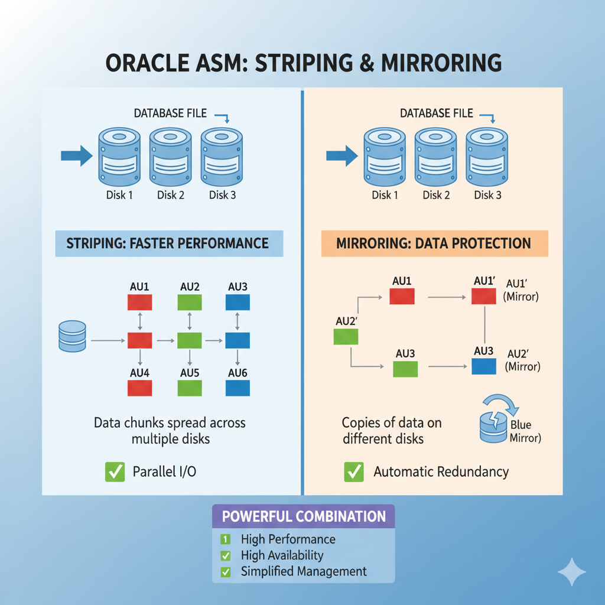

When managing databases, two critical challenges always come up: **performance** and **data protection**. Oracle ASM (Automatic Storage Management) directly addresses these through **striping** and **mirroring**. Let’s break these concepts down in practical terms without going into DBA-only jargon.  

---

## What is Striping?  
Striping is about **spreading data across multiple disks** instead of writing all data into a single disk.  

- **How it works in ASM**:  
  ASM divides files into small chunks called **allocation units (AUs)**. These AUs are evenly distributed across all available disks in the disk group.  
- **Why it matters**:  
  Multiple disks can be read or written to **in parallel**, which improves I/O performance.  

**Example**:  
Suppose you have three disks (Disk1, Disk2, Disk3). A database file isn’t placed entirely on Disk1; instead, its chunks are distributed like this:  

AU1 → Disk1
AU2 → Disk2
AU3 → Disk3
AU4 → Disk1
AU5 → Disk2
AU6 → Disk3

So when the database queries data, it can fetch from all disks simultaneously instead of hitting one disk repeatedly.  

**Result**: Better throughput and faster performance.  

---

## What is Mirroring?  
Mirroring is about **storing multiple copies of the same data** across different disks to protect against disk failures.  

- **How it works in ASM**:  
  ASM supports different redundancy levels:  
  - **Normal redundancy** → 2 copies of data (like RAID 1)  
  - **High redundancy** → 3 copies of data  
  - **External redundancy** → No mirroring (relies on hardware RAID)  

**Example**:  
In **normal redundancy**, if AU1 is placed on Disk1, its mirror copy (AU1’) is placed on Disk2.  

AU1 → Disk1
AU1’ → Disk2
AU2 → Disk2
AU2’ → Disk3
AU3 → Disk3
AU3’ → Disk1

If Disk1 fails, ASM automatically uses the mirrored copy from Disk2 or Disk3 without downtime.  

**Result**: Continuous availability and protection against disk failure.  

---

## Why ASM’s Striping + Mirroring is Powerful  
- **Performance** → Parallel I/O from multiple disks (striping).  
- **Redundancy** → Automatic protection against disk failures (mirroring).  
- **Simplification** → No need to manually manage RAID or complex storage setups. ASM abstracts this for DBAs and ensures optimal data placement automatically.  

---

## Real-World Simplified Case  
Imagine an IT system where:  
- You have 6 disks.  
- ASM is configured with **normal redundancy** and **striping**.  

When a database writes a table:  
- The table’s blocks are **striped** across all 6 disks for performance.  
- Each block also has a **mirror copy** on another disk for redundancy.  

Even if one disk fails, your database continues running, and performance doesn’t bottleneck on a single device.  

---

## Key Takeaway 

ASM’s striping and mirroring give databases:  
- **High performance** (parallel disk usage)  
- **High availability** (automatic data redundancy)  
- **Low admin overhead** (ASM handles placement and recovery)  

In short, ASM makes storage both **faster and safer** without requiring deep storage configuration expertise.

